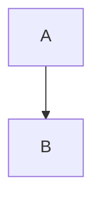

# vitepress-plugin-mermaid-viewer

Mermaid diagrams for VitePress, with fullscreen zoom, pan, copy, and PNG / SVG / JPEG download.

Docs: https://syaning.github.io/vitepress-plugin-mermaid-viewer/

## Install

```bash
pnpm add -D vitepress-plugin-mermaid-viewer mermaid
```

## Usage

Do not wrap the VitePress config. Add the markdown helper and Vite plugin to the exported object, then register the viewer in the theme.

```ts
// .vitepress/config.ts
import { mermaidMarkdown, mermaidPlugin } from 'vitepress-plugin-mermaid-viewer'

export default {
  markdown: {
    config(md) {
      mermaidMarkdown(md)
    },
  },
  vite: {
    plugins: [mermaidPlugin()],
  },
}
```

`mermaidPlugin()` accepts [Mermaid config](https://mermaid.js.org/config/setup/modules/config.html). `theme` is used when set; otherwise the diagram follows VitePress light / dark mode.

```ts
mermaidPlugin({
  theme: 'forest',
  flowchart: { htmlLabels: true },
})
```

```js
// .vitepress/theme/index.js
import DefaultTheme from 'vitepress/theme'
import { enhanceMermaid } from 'vitepress-plugin-mermaid-viewer/client'

export default {
  extends: DefaultTheme,
  enhanceApp({ app }) {
    enhanceMermaid(app)
  },
}
```

Then use standard fences in Markdown:

````md

````

Click a diagram to open the fullscreen viewer.
