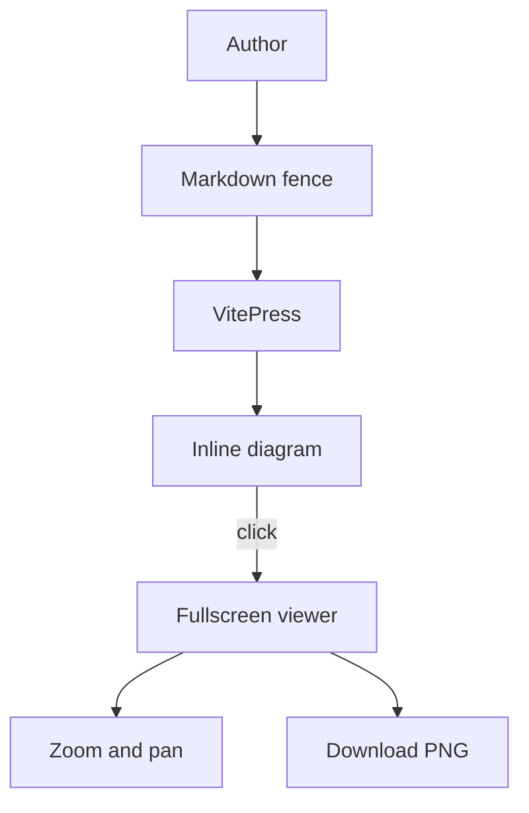
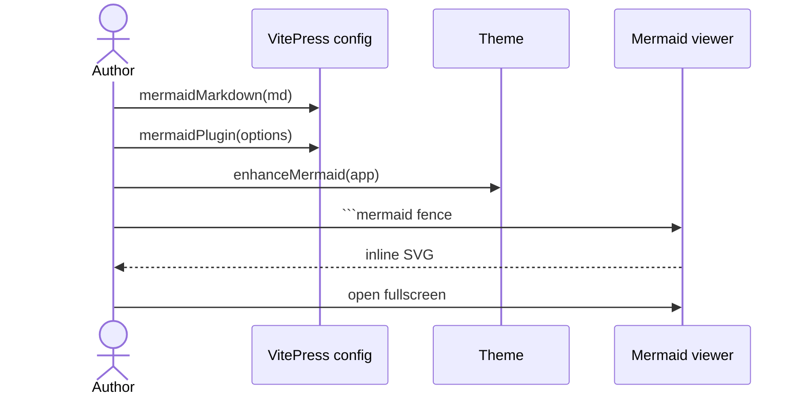
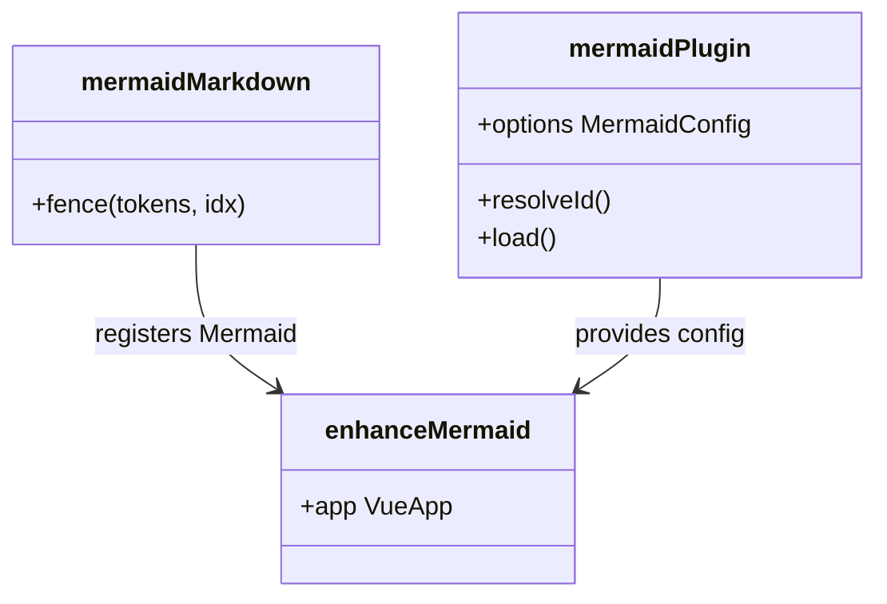
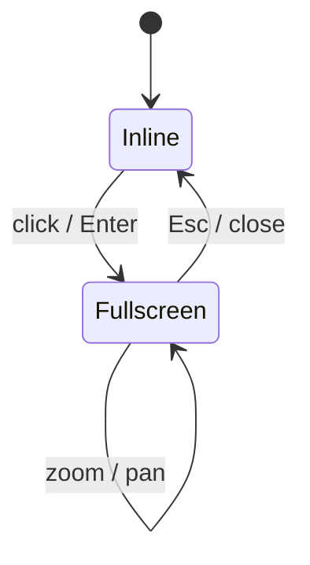
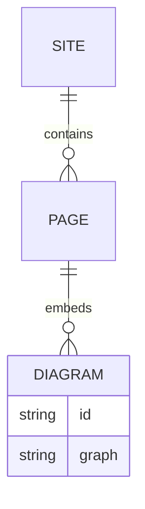
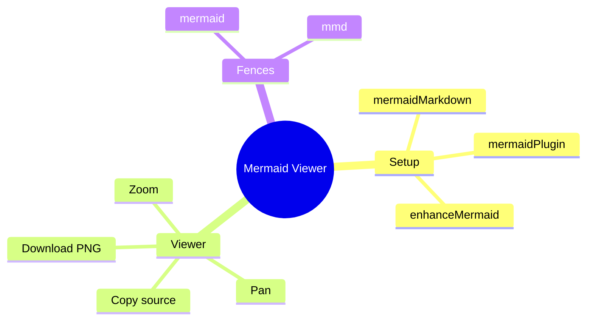
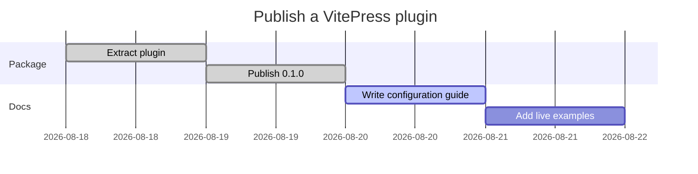
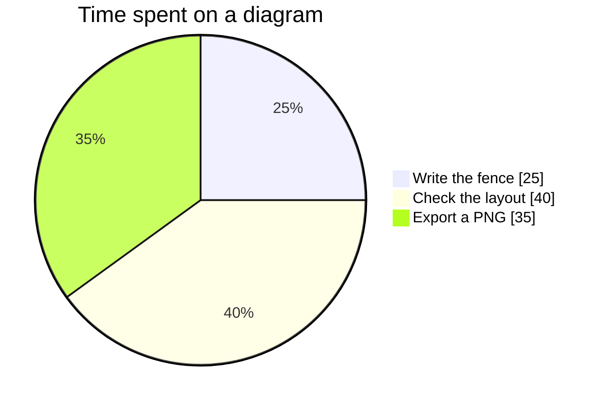
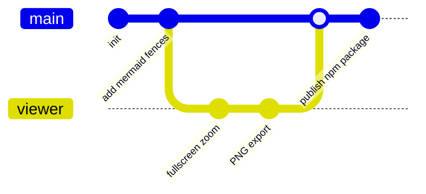

# Examples

Click any diagram to open the fullscreen viewer. These fences use the same `mermaid` syntax you would write in a VitePress page.

## Flowchart

````md

````


## Sequence diagram



## Class diagram



## State diagram



## Entity-relationship



## Mindmap



## Gantt



## Pie chart



## Git graph



`mmd` works as an alias for `mermaid`:

````md
```mmd
pie title Fence aliases
  "mermaid" : 80
  "mmd" : 20
```
````
