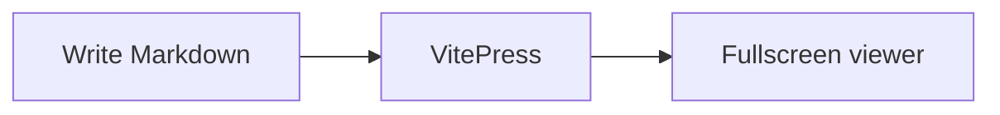

# Getting Started

`vitepress-plugin-mermaid-viewer` renders [Mermaid](https://mermaid.js.org/) fences in VitePress and opens a fullscreen viewer for zoom, pan, copy, and PNG download.

Do not wrap the VitePress config with a helper such as `withMermaid()`. Register the markdown helper, the Vite plugin, and the theme component yourself.

## Install

```bash
pnpm add -D vitepress-plugin-mermaid-viewer mermaid
```

`mermaid` is a peer dependency. VitePress and Vue should already be in the site.

## Configure VitePress

Add the markdown helper and Vite plugin to the exported config object.

```ts
// .vitepress/config.ts
import { defineConfig } from 'vitepress'
import { mermaidMarkdown, mermaidPlugin } from 'vitepress-plugin-mermaid-viewer'

export default defineConfig({
  markdown: {
    config(md) {
      mermaidMarkdown(md)
    },
  },
  vite: {
    plugins: [mermaidPlugin()],
  },
})
```

`mermaidPlugin()` accepts any [Mermaid config](https://mermaid.js.org/config/setup/modules/config.html). See [Configuration](./configuration) for options and theme behavior.

## Register the viewer

Call `enhanceMermaid` from the client entry in the site theme. This registers the `Mermaid` Vue component used by the markdown helper.

```ts
// .vitepress/theme/index.ts
import DefaultTheme from 'vitepress/theme'
import { enhanceMermaid } from 'vitepress-plugin-mermaid-viewer/client'

export default {
  extends: DefaultTheme,
  enhanceApp({ app }) {
    enhanceMermaid(app)
  },
}
```

If the theme already has `enhanceApp`, call `enhanceMermaid(app)` next to the existing logic.

## Write a diagram

Use a standard `mermaid` fence (or the `mmd` alias) in Markdown:

````md

````


Click the diagram (or focus it and press Enter / Space) to open the viewer. Selecting text does not open it.

## Viewer controls

Once the diagram is fullscreen:

| Action | How |
| --- | --- |
| Zoom | Toolbar buttons, mouse wheel, or `+` / `-` |
| Pan | Drag the canvas |
| Reset | Toolbar button, double-click, or `0` |
| Download PNG | Toolbar button |
| Copy source | Toolbar button |
| Close | Close button, backdrop click, or `Esc` |

More diagram types are on the [Examples](./examples) page.
